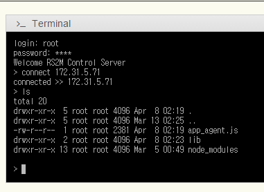
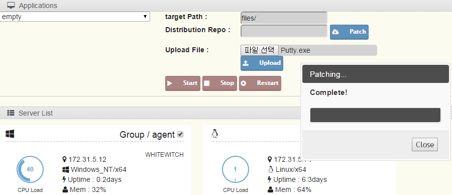

##Chapter 9. Control

chapter 9에서 본, 관리할 어플리케이션을 등록하고, 시작/정지/재시작 버튼은 이곳에서 생략하겠습니다. UI를 지원하니 간단히 테스트 해보시면 됩니다.

이 장에서는 시스템 카드를 관리하고, 실제 해당 서버에 터미널로 접속하여 시스템을 조작하는 방법을 설명하겠습니다.  

 
1) 시스템 카드  
시스템 카드는 설치된 Agent 시스템을 기준으로 자동으로 등록됩니다. 설치된 Agent는 Manager 서버로 정보를 전송하고, 이를 제공된 웹 기반 관리툴에서 확인이 가능합니다.  
그림 4의 기어 모양의 버튼으로 등록된 카드를 삭제할 수 있지만, Agent가 가동되고 있는 서버라면 자동으로 재등록이 진행됩니다. 관리 대상이 아니라면 Agent를 삭제하는 것이 좋습니다.

 
2) 터미널 사용 방법  
전통적으로는 한 시스템 당 하나의 (putty같은) 유틸리티를 사용하여 1:1로 접속하는 방식이 있었습니다. 현재는 하나의 서비스를 위해 수십대의 서버를 관리해야 합니다. 단순히 모니터링이 아닌 서비스 패치, 서비스 어플리케이션 조작, 환경의 변화에 따른 설정 등을 짧은 시간에, 그리고 오류없이 진행해야 합니다. 이는 전통적인 방법에서는 오류를 범할 많은 위험요소가 있었으며, 많은 인력과 비용이 들어갑니다.  
Coconut에서는 이런 비용을 최소화 하기 위해 여러가지 기능을 지원하며, 그 중 지금 소개하는 터미널은 당신에게 분명히 반가운 기능일 것입니다.
그림 7에 보시는 것처럼, 제공되는 화면은 많은 개발자들에게 익숙한 화면일 것입니다.  
  
그림 7 - 터미널에서 특정 서버로 접속한 화면

등록된 계정과 패스를 입력한 후, connect "접속하고자 하는 서버 IP"를 입력하면 특정 서버로 연결이 되고, 이후 ls, dir, curl 등의 명령어를 사용할 수 있습니다. 이 기능은 사실 완벽한 bash 환경을 제공하는 것이 아니, 가상으로 작동합니다. 즉, 해당 시스템에 직접 연결하여 명령을 전달하는 것이 아닌, Manager를 통해 Agent로 명령을 전달하도록 설계되어 있습니다.

이는 우리가 필요한 명령어를 쉽게 추가할 수 있으며, 불필요하거나 원하지 않는 기능들을 손쉽게 제거할 수도 있었습니다. 또한, 특정 기능을 제한적으로 사용하도록 수정할 수도 있습니다.

터미널에서 사용 가능한 명령어들은 이어지는 10장에서 상세히 다루겠습니다.

 
3) 파일 전송 기능

파일을 전송하기 위해 세 가지 세팅이 필요합니다.  
(1) target path : 파일이 Agent에 저장될 때 어떤 경로에 저장될지를 지정할 수 있습니다. 비어 있다면 agent가 설치된 경로에 저장됩니다.  
(2) Upload File : Agent로 보낼 파일을 선택하세요. (추후 압축 파일일 경우 자동으로 풀어주는 옵션을 추가할 예정입니다.) 전송할 파일의 최대 용량은 50MB로 제한되어 있으며, 원한다면 control_box.html 내의 스크립트 코드를 수정하여 적용할 수 있습니다.  
(3) 하단의 Server List탭에서 파일을 전송할 서버를 선택하세요. 한 개 이상 선택이 되어야 합니다.

파일 전송 시, 현재는 Manager로 보낼 때의 상태값만 다이얼로그를 통해 볼 수 있습니다. 이후는 Manager에서 Agent로 보내는 과정을 볼 수 없으며, 이는 추후 개선될 예정입니다.

4) 원격 저장소와 동기화

원격 저장소와 지정한 디렉토리의 모든 파일을 싱크하거나 원격 저장소의 특정 파일을 지정한 디렉토리에 다운받도록 할 수 있습니다.

(1) target path : 동기화할 폴더를 지정하세요.
(2) Distribution Repo : 원격 저장소 혹은 원격 저장소의 특정 파일을 지정하세요.
(3) 하단의 Server List탭에서 파일을 전송할 서버를 선택하세요. 한 개 이상 선택이 되어야 합니다.
(4) Sync : 해당 버튼을 누르면 동기화 혹은 파일전송이 시작됩니다.
(5) Sync forcibly : 이를 체크하면 Agent에서 지정한 저장소와 동기화할 때, 같은 파일인지 여부를 확인하지 않고 예외없이 다운받습니다. 단, 파일을 직접 지정한 경우는 예외없이 다운받습니다.

* (2) Distribution Repo 항목을 기록할 때 끝에 /가 있다면 원격 저장소로 판단합니다. 보안 문제로 원격 저장소의 원격에서 파악할 수 없기에 이렇게 결정되었습니다. 더 좋은 의견이 있다면 git issue에 작성을 부탁드립니다.
* 파일의 갱신여부를 파일의 사이즈로만 판단하고 있습니다. 
* http로는 특정 파일만을 다운 받을 수 있습니다. 폴더 자체를 싱크할 때는 꼭 FTP를 사용하세요.
* 원격 저장소의 구조를 파악하기 위해 지정한 원격 저장소에는 repoList.json 이라는 파일이 존재해야 합니다. 이 파일에는 해당 폴더의 모든 폴더와 파일의 정보가 기록되어 있어야 합니다.
  CoconutTool\externalUtils\makeRepoList 폴더 안의 샘플을 참고하세요. "node makeRepoListFile.js" 로 실행하면 해당 폴더의 정보를 repoList.json 파일에 저장해 줍니다.

